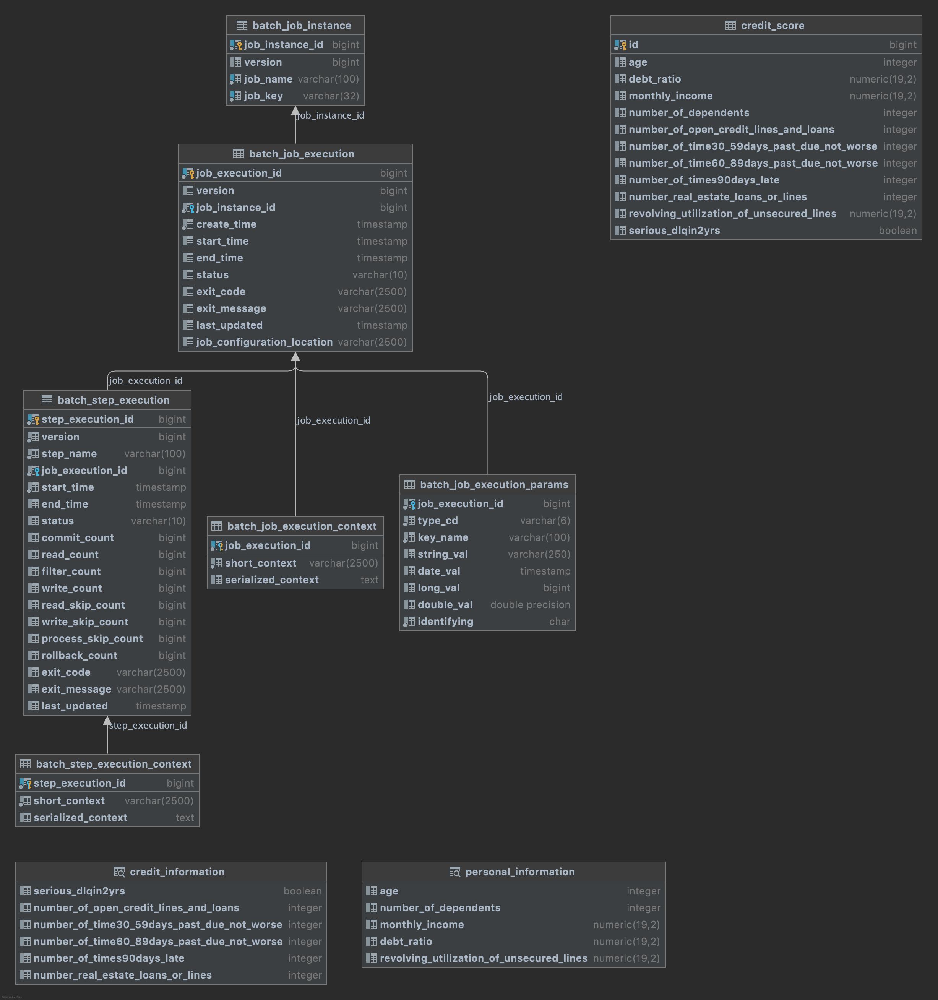

---
> # Data Science Engineer Assignment Brief
>
> We understand that your time is valuable and want to thank you for working on this exercise.
>
> A major aspect of the role is making data available for analysis by data scientists and analysts. In this exercise you will be provided a credit risk dataset and work to make it available for your others to analyze.
>
> To help data scientists get started with their work as quickly as possible, you will also get familiar with the data and share some very basic insights about the dataset.
>
> Please note, that anything you build as part of this assignment is entirely owned by you in perpetuity.
>
>
> ## The Assignment
>
> Please approach both parts of the exercise as if you are working in a real production environment. Do not hesitate to ask any questions about the exercise, and please document any assumptions and decisions you make, and any shortcuts you take (for example, due to time constraints) in the process.
>
> Please share the code, and documents you create or are going to present as part of this project in some public place (GitHub, Gitlab, Google Drive, BitBucket, etc… are all acceptable)
>
> We might store/archive your solution and use it internally for discussion and evaluation.
>
> ### Part 1 - Data Ingestion
>
> The first part of this exercise requires you to build a PoC for a data ingestion system to make incoming CSV data easy to use / query by our Data Scientists. You can find the data in this repository:
>
> * [data_dictionary.md](document/data_dictionary.md) - A variable dictionary is provided with definitions for each variable.
> * [sample_data.csv](data/sample_data.csv) - The dataset is provided to you in the form of a CSV file which can be found in this repository.
>
> You have the freedom to choose how you go about building the PoC but here are a few guidelines:
>
> * You should expect to receive files with data (assume the same format) so your solution should be able to ingest them on a regular basis (e.g. every hour or day).
> * The data should be stored in a central place and accessible/readable by multiple data scientists (even in parallel).
> * It is up to you to choose the underlying data storage/compute engine/database you use, but the data should also be accessible via SQL, Python and/or R.
>
> ### Part 2 - Understanding the Data
>
> A big part of our work is helping data scientists understand the data and build data structures that simplify their work. So it’s important to understand the data for ourselves as well.
>
> For the 2nd part of this exercise we’d like for you to give a short presentation (10-15 minutes) describing the data in a way that would be relevant for data scientists.
>
> A few guidelines for this part:
>
> * Assume that the data scientists are completely unfamiliar with the new data and haven’t heard of it before
> * Please take this as far as you’d like, but note that you are not expected to train a Machine Learning model or come up with a credit policy.
> * You can use whatever tools you prefer for this.
> * Beautiful visualizations are great but descriptive summary tables are also great.
> * Your exploration of the data does not have to be strictly about credit risk or even finance. If you find something interesting, we’d like to know about it.
>
---

# 🎯 Solution

Spring-Boot Batch, JPA and Web to load CSV - [sample_data.csv](/data/sample_data.csv) to the database (PostgreSQL). It's scheduled to run every 10 minutes as default. In addition, a web API is created to run the batch over HTTP.  

Alternatively, you can also run a stored procedure [sp_cron-credit_score](/plpgsql/sp_cron-credit_score.sql).
It may help engineers to set up a running service w/o any additional instance as the application is able to install/bundle with DBMS, PostgreSQL.

Please refer to:  for the database schema, and table view is provided as SQL - [schema_view](document/schema_view.sql)

# 🔥 The API

> [http://localhost:8080/jobs/run](http://localhost:8080/jobs/run)

Example,
> ○ curl -L http://localhost:8080/jobs/run  
> Job run finished...

In slf4j log,
> 021-10-31 11:16:32 INFO  - Step: [step1] executed in 20ms  
> 2021-10-31 11:16:32 INFO  - Job: [SimpleJob: [name=readCSVFileJob]] completed with the following parameters: [{JobID=1635646592613}] and the following status: [FAILED] in 89ms  
> 2021-10-31 11:18:04 INFO  - Job: [SimpleJob: [name=readCSVFileJob]] launched with the following parameters: [{JobID=1635646684675}]
> 2021-10-31 11:18:04 INFO  - Executing step: [step1]  
> 2021-10-31 11:18:04 INFO  - HikariPool-1 - Starting...  
> 2021-10-31 11:18:04 INFO  - HikariPool-1 - Start completed.  
> 2021-10-31 11:19:48 INFO  - Step: [step1] executed in 1m43s637ms  
> 2021-10-31 11:19:48 INFO  - Executing step: [step2]  
> 2021-10-31 11:19:48 INFO  - Step: [step2] executed in 12ms  
> 2021-10-31 11:19:48 INFO  - Job: [SimpleJob: [name=readCSVFileJob]] completed with the following parameters: [{JobID=1635646684675}] and the following status: [COMPLETED] in 1m43s685ms  
> 2021-10-31 11:20:00 INFO  - Job: [SimpleJob: [name=readCSVFileJob]] launched with the following parameters: [{JobID=1635646800009}]  

# 🏗️ Preprocessing 

For Data Cleaning and Labeling, [cron-credit_score.sh](/script/cron-credit_score.sh) is needed to run at first.
It changes the data csv file to a new csv file with cleanup_ prefix. This file is used to run the batch.

# 🏃‍♀️ How to Run the project locally

The following is required:
- *OpenJDK* >= 11
- *[PostgreSQL](https://www.postgresql.org/)* >= 14
- *Python* >= 3.8
- *Bash shell* >= 3.2
- *Perl* >= 5.18

Example,
  ```
  ○ sh cron-credit_score.sh ../data sample_data.csv
  ```
***The first argument is the directory of the data file and the second is the data file.***

  ```
  ○ java -classpath dse_interview_jar com.app_creative.poc.Application
  ```

# 🚀 Look-and-Feel of the data

Got to [credit_scoring_data](notebook/credit_scoring_data.ipynb)and its [Jupyter Notebook Markdown](/document/presentation.md) which presents the characteristics of the dataset.

For future, *[Kafka](https://kafka.apache.org/)* - distribution event streaming is recommended to a topic. 