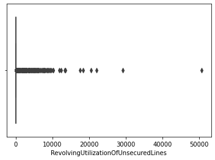
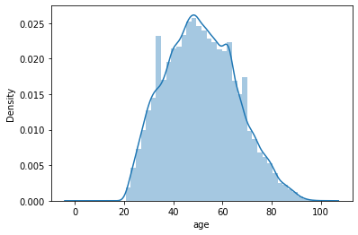
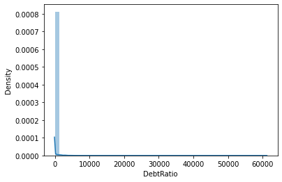
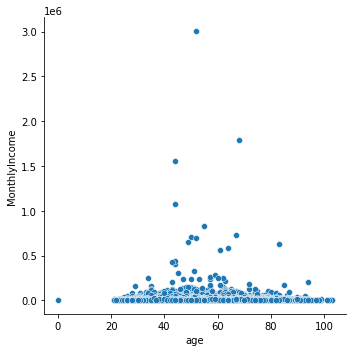
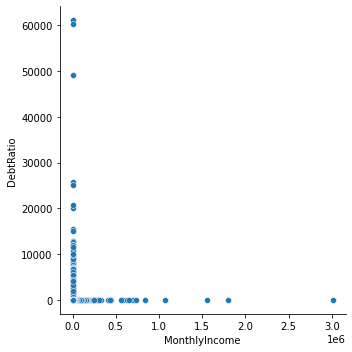

```python
# Filter the uneccesary warnings
import warnings
warnings.filterwarnings("ignore")

```


```python
# Import pandas and numpy
import pandas as pd
import numpy as np

# Fix the random seed
np.random.seed(7)
```

# 1. Loading and understanding the dataset


```python
## Load the dictionary
```


```python
columns = pd.read_excel('./Data Dictionary.xls')
columns
```


<div>
<table border="1" class="dataframe">
  <thead>
    <tr style="text-align: right;">
      <th></th>
      <th>Unnamed: 0</th>
      <th>Unnamed: 1</th>
      <th>Unnamed: 2</th>
    </tr>
  </thead>
  <tbody>
    <tr>
      <th>0</th>
      <td>Variable Name</td>
      <td>Description</td>
      <td>Type</td>
    </tr>
    <tr>
      <th>1</th>
      <td>SeriousDlqin2yrs</td>
      <td>Person experienced 90 days past due delinquenc...</td>
      <td>Y/N</td>
    </tr>
    <tr>
      <th>2</th>
      <td>RevolvingUtilizationOfUnsecuredLines</td>
      <td>Total balance on credit cards and personal lin...</td>
      <td>percentage</td>
    </tr>
    <tr>
      <th>3</th>
      <td>age</td>
      <td>Age of borrower in years</td>
      <td>integer</td>
    </tr>
    <tr>
      <th>4</th>
      <td>NumberOfTime30-59DaysPastDueNotWorse</td>
      <td>Number of times borrower has been 30-59 days p...</td>
      <td>integer</td>
    </tr>
    <tr>
      <th>5</th>
      <td>DebtRatio</td>
      <td>Monthly debt payments, alimony,living costs di...</td>
      <td>percentage</td>
    </tr>
    <tr>
      <th>6</th>
      <td>MonthlyIncome</td>
      <td>Monthly income</td>
      <td>real</td>
    </tr>
    <tr>
      <th>7</th>
      <td>NumberOfOpenCreditLinesAndLoans</td>
      <td>Number of Open loans (installment like car loa...</td>
      <td>integer</td>
    </tr>
    <tr>
      <th>8</th>
      <td>NumberOfTimes90DaysLate</td>
      <td>Number of times borrower has been 90 days or m...</td>
      <td>integer</td>
    </tr>
    <tr>
      <th>9</th>
      <td>NumberRealEstateLoansOrLines</td>
      <td>Number of mortgage and real estate loans inclu...</td>
      <td>integer</td>
    </tr>
    <tr>
      <th>10</th>
      <td>NumberOfTime60-89DaysPastDueNotWorse</td>
      <td>Number of times borrower has been 60-89 days p...</td>
      <td>integer</td>
    </tr>
    <tr>
      <th>11</th>
      <td>NumberOfDependents</td>
      <td>Number of dependents in family excluding thems...</td>
      <td>integer</td>
    </tr>
  </tbody>
</table>
</div>


## Load the dataset

### The first 10 rows from the DataFrame


```python
data = pd.read_csv("sample_data.csv")
data.head(10).T
```


<div>
<table border="1" class="dataframe">
  <thead>
    <tr style="text-align: right;">
      <th></th>
      <th>0</th>
      <th>1</th>
      <th>2</th>
      <th>3</th>
      <th>4</th>
      <th>5</th>
      <th>6</th>
      <th>7</th>
      <th>8</th>
      <th>9</th>
    </tr>
  </thead>
  <tbody>
    <tr>
      <th>Unnamed: 0</th>
      <td>1.000000</td>
      <td>2.000000</td>
      <td>3.000000</td>
      <td>4.00000</td>
      <td>5.000000</td>
      <td>6.000000</td>
      <td>8.000000</td>
      <td>10.000000</td>
      <td>11.000000</td>
      <td>12.000000</td>
    </tr>
    <tr>
      <th>SeriousDlqin2yrs</th>
      <td>1.000000</td>
      <td>0.000000</td>
      <td>0.000000</td>
      <td>0.00000</td>
      <td>0.000000</td>
      <td>0.000000</td>
      <td>0.000000</td>
      <td>0.000000</td>
      <td>0.000000</td>
      <td>0.000000</td>
    </tr>
    <tr>
      <th>RevolvingUtilizationOfUnsecuredLines</th>
      <td>0.766127</td>
      <td>0.957151</td>
      <td>0.658180</td>
      <td>0.23381</td>
      <td>0.907239</td>
      <td>0.213179</td>
      <td>0.754464</td>
      <td>0.189169</td>
      <td>0.644226</td>
      <td>0.018798</td>
    </tr>
    <tr>
      <th>age</th>
      <td>45.000000</td>
      <td>40.000000</td>
      <td>38.000000</td>
      <td>30.00000</td>
      <td>49.000000</td>
      <td>74.000000</td>
      <td>39.000000</td>
      <td>57.000000</td>
      <td>30.000000</td>
      <td>51.000000</td>
    </tr>
    <tr>
      <th>NumberOfTime30-59DaysPastDueNotWorse</th>
      <td>2.000000</td>
      <td>0.000000</td>
      <td>1.000000</td>
      <td>0.00000</td>
      <td>1.000000</td>
      <td>0.000000</td>
      <td>0.000000</td>
      <td>0.000000</td>
      <td>0.000000</td>
      <td>0.000000</td>
    </tr>
    <tr>
      <th>DebtRatio</th>
      <td>0.802982</td>
      <td>0.121876</td>
      <td>0.085113</td>
      <td>0.03605</td>
      <td>0.024926</td>
      <td>0.375607</td>
      <td>0.209940</td>
      <td>0.606291</td>
      <td>0.309476</td>
      <td>0.531529</td>
    </tr>
    <tr>
      <th>MonthlyIncome</th>
      <td>9120.000000</td>
      <td>2600.000000</td>
      <td>3042.000000</td>
      <td>3300.00000</td>
      <td>63588.000000</td>
      <td>3500.000000</td>
      <td>3500.000000</td>
      <td>23684.000000</td>
      <td>2500.000000</td>
      <td>6501.000000</td>
    </tr>
    <tr>
      <th>NumberOfOpenCreditLinesAndLoans</th>
      <td>13.000000</td>
      <td>4.000000</td>
      <td>2.000000</td>
      <td>5.00000</td>
      <td>7.000000</td>
      <td>3.000000</td>
      <td>8.000000</td>
      <td>9.000000</td>
      <td>5.000000</td>
      <td>7.000000</td>
    </tr>
    <tr>
      <th>NumberOfTimes90DaysLate</th>
      <td>0.000000</td>
      <td>0.000000</td>
      <td>1.000000</td>
      <td>0.00000</td>
      <td>0.000000</td>
      <td>0.000000</td>
      <td>0.000000</td>
      <td>0.000000</td>
      <td>0.000000</td>
      <td>0.000000</td>
    </tr>
    <tr>
      <th>NumberRealEstateLoansOrLines</th>
      <td>6.000000</td>
      <td>0.000000</td>
      <td>0.000000</td>
      <td>0.00000</td>
      <td>1.000000</td>
      <td>1.000000</td>
      <td>0.000000</td>
      <td>4.000000</td>
      <td>0.000000</td>
      <td>2.000000</td>
    </tr>
    <tr>
      <th>NumberOfTime60-89DaysPastDueNotWorse</th>
      <td>0.000000</td>
      <td>0.000000</td>
      <td>0.000000</td>
      <td>0.00000</td>
      <td>0.000000</td>
      <td>0.000000</td>
      <td>0.000000</td>
      <td>0.000000</td>
      <td>0.000000</td>
      <td>0.000000</td>
    </tr>
    <tr>
      <th>NumberOfDependents</th>
      <td>2.000000</td>
      <td>1.000000</td>
      <td>0.000000</td>
      <td>0.00000</td>
      <td>0.000000</td>
      <td>1.000000</td>
      <td>0.000000</td>
      <td>2.000000</td>
      <td>0.000000</td>
      <td>2.000000</td>
    </tr>
  </tbody>
</table>
</div>


### The sample function randomly samples 10 rows from the DataFrame


```python
data.sample(10).T
```


<div>
<table border="1" class="dataframe">
  <thead>
    <tr style="text-align: right;">
      <th></th>
      <th>101863</th>
      <th>19008</th>
      <th>117997</th>
      <th>99895</th>
      <th>45042</th>
      <th>114519</th>
      <th>59952</th>
      <th>40287</th>
      <th>119531</th>
      <th>20013</th>
    </tr>
  </thead>
  <tbody>
    <tr>
      <th>Unnamed: 0</th>
      <td>127060.000000</td>
      <td>23774.000000</td>
      <td>147171.000000</td>
      <td>124606.00000</td>
      <td>56218.000000</td>
      <td>142826.000000</td>
      <td>74749.00000</td>
      <td>50352.000000</td>
      <td>149078.000000</td>
      <td>25025.000000</td>
    </tr>
    <tr>
      <th>SeriousDlqin2yrs</th>
      <td>0.000000</td>
      <td>1.000000</td>
      <td>0.000000</td>
      <td>1.00000</td>
      <td>0.000000</td>
      <td>0.000000</td>
      <td>1.00000</td>
      <td>0.000000</td>
      <td>0.000000</td>
      <td>0.000000</td>
    </tr>
    <tr>
      <th>RevolvingUtilizationOfUnsecuredLines</th>
      <td>0.018762</td>
      <td>0.639319</td>
      <td>0.407724</td>
      <td>1.00000</td>
      <td>0.023977</td>
      <td>0.491959</td>
      <td>1.00000</td>
      <td>0.000453</td>
      <td>0.058108</td>
      <td>0.000000</td>
    </tr>
    <tr>
      <th>age</th>
      <td>40.000000</td>
      <td>63.000000</td>
      <td>69.000000</td>
      <td>37.00000</td>
      <td>36.000000</td>
      <td>45.000000</td>
      <td>50.00000</td>
      <td>58.000000</td>
      <td>63.000000</td>
      <td>43.000000</td>
    </tr>
    <tr>
      <th>NumberOfTime30-59DaysPastDueNotWorse</th>
      <td>0.000000</td>
      <td>0.000000</td>
      <td>0.000000</td>
      <td>0.00000</td>
      <td>0.000000</td>
      <td>0.000000</td>
      <td>2.00000</td>
      <td>2.000000</td>
      <td>0.000000</td>
      <td>0.000000</td>
    </tr>
    <tr>
      <th>DebtRatio</th>
      <td>0.362659</td>
      <td>0.704918</td>
      <td>0.313948</td>
      <td>0.30288</td>
      <td>0.678491</td>
      <td>0.653061</td>
      <td>0.12802</td>
      <td>0.214443</td>
      <td>0.409190</td>
      <td>0.494584</td>
    </tr>
    <tr>
      <th>MonthlyIncome</th>
      <td>4000.000000</td>
      <td>2500.000000</td>
      <td>2200.000000</td>
      <td>5833.00000</td>
      <td>3100.000000</td>
      <td>5732.000000</td>
      <td>5256.00000</td>
      <td>65000.000000</td>
      <td>15559.000000</td>
      <td>6000.000000</td>
    </tr>
    <tr>
      <th>NumberOfOpenCreditLinesAndLoans</th>
      <td>6.000000</td>
      <td>8.000000</td>
      <td>7.000000</td>
      <td>5.00000</td>
      <td>4.000000</td>
      <td>13.000000</td>
      <td>1.00000</td>
      <td>8.000000</td>
      <td>20.000000</td>
      <td>7.000000</td>
    </tr>
    <tr>
      <th>NumberOfTimes90DaysLate</th>
      <td>0.000000</td>
      <td>0.000000</td>
      <td>0.000000</td>
      <td>0.00000</td>
      <td>0.000000</td>
      <td>0.000000</td>
      <td>0.00000</td>
      <td>0.000000</td>
      <td>0.000000</td>
      <td>0.000000</td>
    </tr>
    <tr>
      <th>NumberRealEstateLoansOrLines</th>
      <td>2.000000</td>
      <td>0.000000</td>
      <td>0.000000</td>
      <td>0.00000</td>
      <td>1.000000</td>
      <td>1.000000</td>
      <td>0.00000</td>
      <td>1.000000</td>
      <td>3.000000</td>
      <td>2.000000</td>
    </tr>
    <tr>
      <th>NumberOfTime60-89DaysPastDueNotWorse</th>
      <td>0.000000</td>
      <td>0.000000</td>
      <td>0.000000</td>
      <td>0.00000</td>
      <td>0.000000</td>
      <td>0.000000</td>
      <td>1.00000</td>
      <td>0.000000</td>
      <td>0.000000</td>
      <td>0.000000</td>
    </tr>
    <tr>
      <th>NumberOfDependents</th>
      <td>0.000000</td>
      <td>0.000000</td>
      <td>0.000000</td>
      <td>2.00000</td>
      <td>1.000000</td>
      <td>1.000000</td>
      <td>0.00000</td>
      <td>0.000000</td>
      <td>0.000000</td>
      <td>0.000000</td>
    </tr>
  </tbody>
</table>
</div>


### Data dimension


```python
data.shape
```


    (120269, 12)


```python
### Data columns
```


```python
data.columns
```


    Index(['Unnamed: 0', 'SeriousDlqin2yrs',
           'RevolvingUtilizationOfUnsecuredLines', 'age',
           'NumberOfTime30-59DaysPastDueNotWorse', 'DebtRatio', 'MonthlyIncome',
           'NumberOfOpenCreditLinesAndLoans', 'NumberOfTimes90DaysLate',
           'NumberRealEstateLoansOrLines', 'NumberOfTime60-89DaysPastDueNotWorse',
           'NumberOfDependents'],
          dtype='object')


## Find out how many unique labels/classes are there in the dataset


```python
data['NumberOfDependents'].unique()
```


    array([ 2.,  1.,  0.,  3.,  4.,  5.,  6.,  8.,  7., 20., 10.,  9., 13.])


```python
#### Wondering who has 20 dependents
```


```python
data.loc[data['NumberOfDependents']>=20]
```


<div>
<table border="1" class="dataframe">
  <thead>
    <tr style="text-align: right;">
      <th></th>
      <th>Unnamed: 0</th>
      <th>SeriousDlqin2yrs</th>
      <th>RevolvingUtilizationOfUnsecuredLines</th>
      <th>age</th>
      <th>NumberOfTime30-59DaysPastDueNotWorse</th>
      <th>DebtRatio</th>
      <th>MonthlyIncome</th>
      <th>NumberOfOpenCreditLinesAndLoans</th>
      <th>NumberOfTimes90DaysLate</th>
      <th>NumberRealEstateLoansOrLines</th>
      <th>NumberOfTime60-89DaysPastDueNotWorse</th>
      <th>NumberOfDependents</th>
    </tr>
  </thead>
  <tbody>
    <tr>
      <th>5075</th>
      <td>6300</td>
      <td>0</td>
      <td>0.226616</td>
      <td>40</td>
      <td>1</td>
      <td>0.576539</td>
      <td>6316.0</td>
      <td>11</td>
      <td>2</td>
      <td>1</td>
      <td>0</td>
      <td>20.0</td>
    </tr>
  </tbody>
</table>
</div>


```python
# Import the Counter class
from collections import Counter
```

## See how the different classes[age] in the dataset are distributed below


```python
classes = Counter(data["age"].values)
classes.most_common()
```


    [(49, 3217),
     (48, 3163),
     (47, 3134),
     (46, 3117),
     (50, 3105),
     (51, 3001),
     (53, 2974),
     (45, 2969),
     (52, 2951),
     (54, 2905),
     (56, 2846),
     (44, 2820),
     (63, 2802),
     (43, 2751),
     (55, 2745),
     (62, 2725),
     (61, 2713),
     (58, 2702),
     (57, 2699),
     (41, 2660),
     (40, 2645),
     (42, 2633),
     (59, 2574),
     (39, 2566),
     (60, 2505),
     (64, 2278),
     (38, 2266),
     (37, 2157),
     (36, 2056),
     (33, 1957),
     (35, 1930),
     (65, 1922),
     (66, 1874),
     (34, 1867),
     (67, 1835),
     (32, 1804),
     (31, 1783),
     (30, 1674),
     (68, 1613),
     (29, 1468),
     (69, 1443),
     (28, 1349),
     (70, 1270),
     (72, 1226),
     (71, 1212),
     (27, 1126),
     (73, 1093),
     (74, 1059),
     (26, 1012),
     (75, 860),
     (76, 839),
     (25, 797),
     (77, 775),
     (78, 749),
     (79, 697),
     (24, 652),
     (80, 621),
     (81, 530),
     (23, 515),
     (82, 443),
     (22, 329),
     (83, 317),
     (85, 309),
     (84, 304),
     (86, 254),
     (87, 211),
     (88, 193),
     (89, 178),
     (21, 130),
     (90, 114),
     (91, 83),
     (92, 55),
     (93, 48),
     (94, 21),
     (95, 20),
     (97, 10),
     (96, 6),
     (98, 3),
     (99, 3),
     (103, 2),
     (102, 2),
     (101, 2),
     (0, 1)]


```python
class_dist = pd.DataFrame(classes.most_common(), columns=['Age', 'Num_Observations'])
class_dist
```


<div>
<table border="1" class="dataframe">
  <thead>
    <tr style="text-align: right;">
      <th></th>
      <th>Age</th>
      <th>Num_Observations</th>
    </tr>
  </thead>
  <tbody>
    <tr>
      <th>0</th>
      <td>49</td>
      <td>3217</td>
    </tr>
    <tr>
      <th>1</th>
      <td>48</td>
      <td>3163</td>
    </tr>
    <tr>
      <th>2</th>
      <td>47</td>
      <td>3134</td>
    </tr>
    <tr>
      <th>3</th>
      <td>46</td>
      <td>3117</td>
    </tr>
    <tr>
      <th>4</th>
      <td>50</td>
      <td>3105</td>
    </tr>
    <tr>
      <th>...</th>
      <td>...</td>
      <td>...</td>
    </tr>
    <tr>
      <th>78</th>
      <td>99</td>
      <td>3</td>
    </tr>
    <tr>
      <th>79</th>
      <td>103</td>
      <td>2</td>
    </tr>
    <tr>
      <th>80</th>
      <td>102</td>
      <td>2</td>
    </tr>
    <tr>
      <th>81</th>
      <td>101</td>
      <td>2</td>
    </tr>
    <tr>
      <th>82</th>
      <td>0</td>
      <td>1</td>
    </tr>
  </tbody>
</table>
<p>83 rows × 2 columns</p>
</div>


```python
data.isna().sum()
```


    Unnamed: 0                              0
    SeriousDlqin2yrs                        0
    RevolvingUtilizationOfUnsecuredLines    0
    age                                     0
    NumberOfTime30-59DaysPastDueNotWorse    0
    DebtRatio                               0
    MonthlyIncome                           0
    NumberOfOpenCreditLinesAndLoans         0
    NumberOfTimes90DaysLate                 0
    NumberRealEstateLoansOrLines            0
    NumberOfTime60-89DaysPastDueNotWorse    0
    NumberOfDependents                      0
    dtype: int64


```python
data.describe().T
```


<div>
<table border="1" class="dataframe">
  <thead>
    <tr style="text-align: right;">
      <th></th>
      <th>count</th>
      <th>mean</th>
      <th>std</th>
      <th>min</th>
      <th>25%</th>
      <th>50%</th>
      <th>75%</th>
      <th>max</th>
    </tr>
  </thead>
  <tbody>
    <tr>
      <th>Unnamed: 0</th>
      <td>120269.0</td>
      <td>75026.012514</td>
      <td>43286.029117</td>
      <td>1.0</td>
      <td>37678.000000</td>
      <td>74969.000000</td>
      <td>112494.000000</td>
      <td>150000.0</td>
    </tr>
    <tr>
      <th>SeriousDlqin2yrs</th>
      <td>120269.0</td>
      <td>0.069486</td>
      <td>0.254280</td>
      <td>0.0</td>
      <td>0.000000</td>
      <td>0.000000</td>
      <td>0.000000</td>
      <td>1.0</td>
    </tr>
    <tr>
      <th>RevolvingUtilizationOfUnsecuredLines</th>
      <td>120269.0</td>
      <td>5.899873</td>
      <td>257.040685</td>
      <td>0.0</td>
      <td>0.035084</td>
      <td>0.177282</td>
      <td>0.579428</td>
      <td>50708.0</td>
    </tr>
    <tr>
      <th>age</th>
      <td>120269.0</td>
      <td>51.289792</td>
      <td>14.426684</td>
      <td>0.0</td>
      <td>40.000000</td>
      <td>51.000000</td>
      <td>61.000000</td>
      <td>103.0</td>
    </tr>
    <tr>
      <th>NumberOfTime30-59DaysPastDueNotWorse</th>
      <td>120269.0</td>
      <td>0.381769</td>
      <td>3.499234</td>
      <td>0.0</td>
      <td>0.000000</td>
      <td>0.000000</td>
      <td>0.000000</td>
      <td>98.0</td>
    </tr>
    <tr>
      <th>DebtRatio</th>
      <td>120269.0</td>
      <td>26.598777</td>
      <td>424.446457</td>
      <td>0.0</td>
      <td>0.143388</td>
      <td>0.296023</td>
      <td>0.482559</td>
      <td>61106.5</td>
    </tr>
    <tr>
      <th>MonthlyIncome</th>
      <td>120269.0</td>
      <td>6670.221237</td>
      <td>14384.674215</td>
      <td>0.0</td>
      <td>3400.000000</td>
      <td>5400.000000</td>
      <td>8249.000000</td>
      <td>3008750.0</td>
    </tr>
    <tr>
      <th>NumberOfOpenCreditLinesAndLoans</th>
      <td>120269.0</td>
      <td>8.758475</td>
      <td>5.172835</td>
      <td>0.0</td>
      <td>5.000000</td>
      <td>8.000000</td>
      <td>11.000000</td>
      <td>58.0</td>
    </tr>
    <tr>
      <th>NumberOfTimes90DaysLate</th>
      <td>120269.0</td>
      <td>0.211925</td>
      <td>3.465276</td>
      <td>0.0</td>
      <td>0.000000</td>
      <td>0.000000</td>
      <td>0.000000</td>
      <td>98.0</td>
    </tr>
    <tr>
      <th>NumberRealEstateLoansOrLines</th>
      <td>120269.0</td>
      <td>1.054519</td>
      <td>1.149273</td>
      <td>0.0</td>
      <td>0.000000</td>
      <td>1.000000</td>
      <td>2.000000</td>
      <td>54.0</td>
    </tr>
    <tr>
      <th>NumberOfTime60-89DaysPastDueNotWorse</th>
      <td>120269.0</td>
      <td>0.187829</td>
      <td>3.447901</td>
      <td>0.0</td>
      <td>0.000000</td>
      <td>0.000000</td>
      <td>0.000000</td>
      <td>98.0</td>
    </tr>
    <tr>
      <th>NumberOfDependents</th>
      <td>120269.0</td>
      <td>0.851832</td>
      <td>1.148391</td>
      <td>0.0</td>
      <td>0.000000</td>
      <td>0.000000</td>
      <td>2.000000</td>
      <td>20.0</td>
    </tr>
  </tbody>
</table>
</div>


```python
data.info()
```

    <class 'pandas.core.frame.DataFrame'>
    RangeIndex: 120269 entries, 0 to 120268
    Data columns (total 12 columns):
     #   Column                                Non-Null Count   Dtype  
    ---  ------                                --------------   -----  
     0   Unnamed: 0                            120269 non-null  int64  
     1   SeriousDlqin2yrs                      120269 non-null  int64  
     2   RevolvingUtilizationOfUnsecuredLines  120269 non-null  float64
     3   age                                   120269 non-null  int64  
     4   NumberOfTime30-59DaysPastDueNotWorse  120269 non-null  int64  
     5   DebtRatio                             120269 non-null  float64
     6   MonthlyIncome                         120269 non-null  float64
     7   NumberOfOpenCreditLinesAndLoans       120269 non-null  int64  
     8   NumberOfTimes90DaysLate               120269 non-null  int64  
     9   NumberRealEstateLoansOrLines          120269 non-null  int64  
     10  NumberOfTime60-89DaysPastDueNotWorse  120269 non-null  int64  
     11  NumberOfDependents                    120269 non-null  float64
    dtypes: float64(4), int64(8)
    memory usage: 11.0 MB


```python
# Import seaborn
import seaborn as sns
```


```python
sns.boxplot(data=data, x='RevolvingUtilizationOfUnsecuredLines')
```


    <AxesSubplot:xlabel='RevolvingUtilizationOfUnsecuredLines'>


    

    


```python
sns.distplot(data.age)
```


    <AxesSubplot:xlabel='age', ylabel='Density'>


    

    


```python
sns.distplot(data.DebtRatio)
```


    <AxesSubplot:xlabel='DebtRatio', ylabel='Density'>


    

    


```python
sns.relplot(x = 'age', y = 'MonthlyIncome', data=data)
```


    <seaborn.axisgrid.FacetGrid at 0x11c8a80a0>


    

    


```python
sns.relplot(x = 'MonthlyIncome', y = 'DebtRatio', data=data)
```


    <seaborn.axisgrid.FacetGrid at 0x11d6337f0>


    

    


## Senario 1, Assuming total balance of credit and debt has 50% creteria to "pass" assessment as a good score, for example


```python
from sklearn.model_selection import train_test_split
```


```python
data['result'] = (data['age']<=90) & (data['RevolvingUtilizationOfUnsecuredLines']>=.5) & (data['DebtRatio']<=.5)

X = data.iloc[:,1:12].values.astype(int)
y = data.iloc[:,12].values.astype(int)

X_train, X_test, y_train, y_test = train_test_split(X, y, test_size=0.2, random_state=np.random.seed(7))

print(X_train, y_train)
```

    [[ 0  0 30 ...  0  0  0]
     [ 0  0 81 ...  0  0  0]
     [ 0  0 26 ...  0  0  1]
     ...
     [ 0  0 50 ...  2  0  1]
     [ 0  0 43 ...  1  0  2]
     [ 1  0 55 ...  1  1  2]] [0 0 0 ... 0 1 1]


```python
# Import GridSearchCV
from sklearn.model_selection import RandomizedSearchCV

# Other imports
from sklearn.linear_model import LogisticRegression
from sklearn.utils.fixes import loguniform
```


```python
logreg = LogisticRegression()

# Create a dictionary param_grid = C=loguniform(0.01, 1) as a continuous random variable
param_grid = dict(C=loguniform(0.01, 1))
```


```python
# Instantiate RandomizedSearchCV with the required parameters
random_model = RandomizedSearchCV(estimator=logreg, param_distributions=param_grid, cv=5)

# Fit random_model to the data
random_model_result = random_model.fit(X_train, y_train)

# Summarize results
best_score, best_params = random_model_result.best_score_, random_model_result.best_params_
print("Best score: %.2f using %s" % (best_score*100., best_params))
```

    Best score: 82.11 using {'C': 0.11108015822053222}


```python
random_model_result.score(X_test, y_test)
```


    0.8158726199384718


